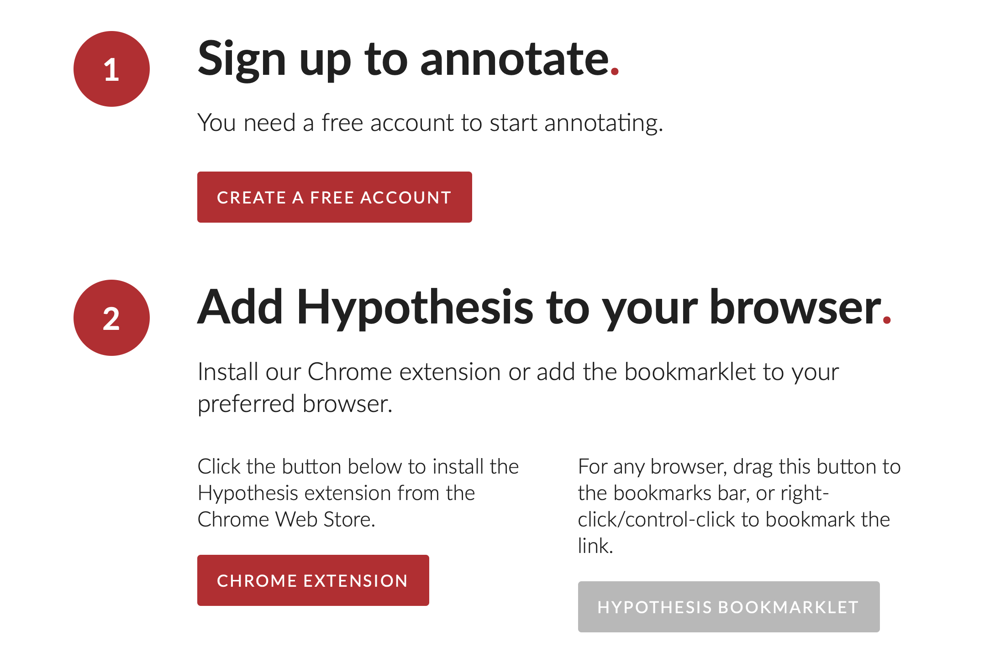
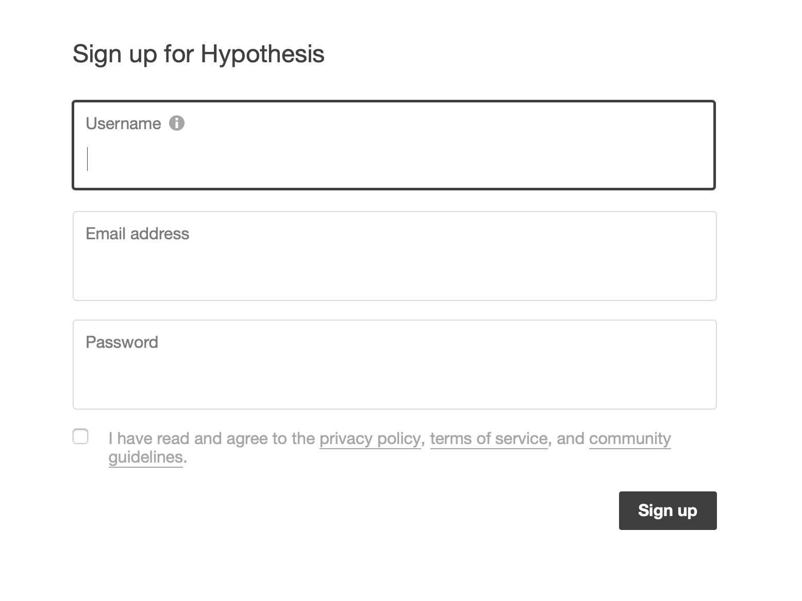
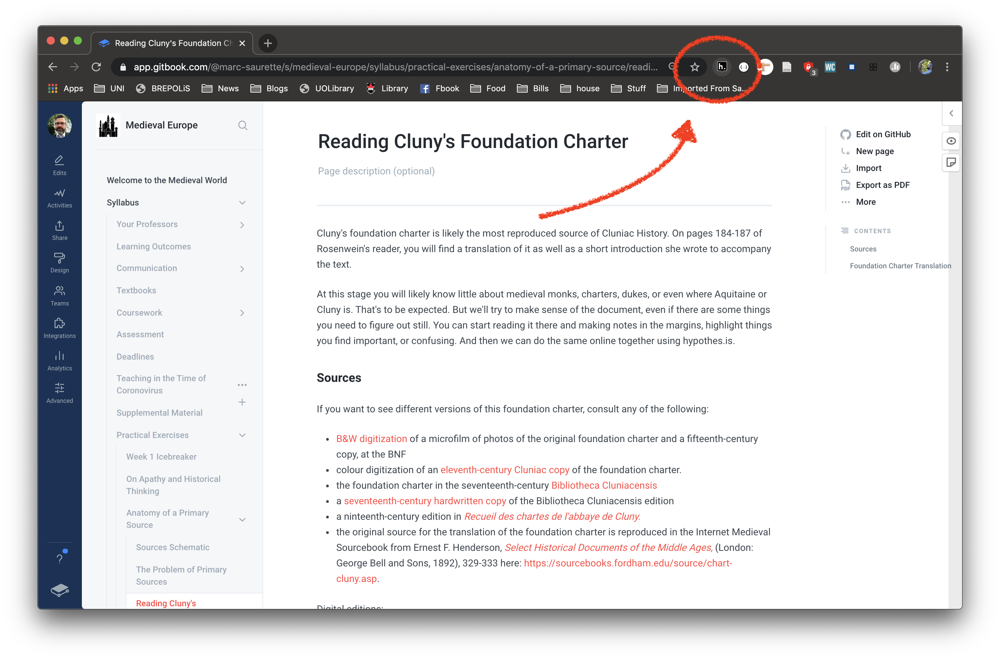
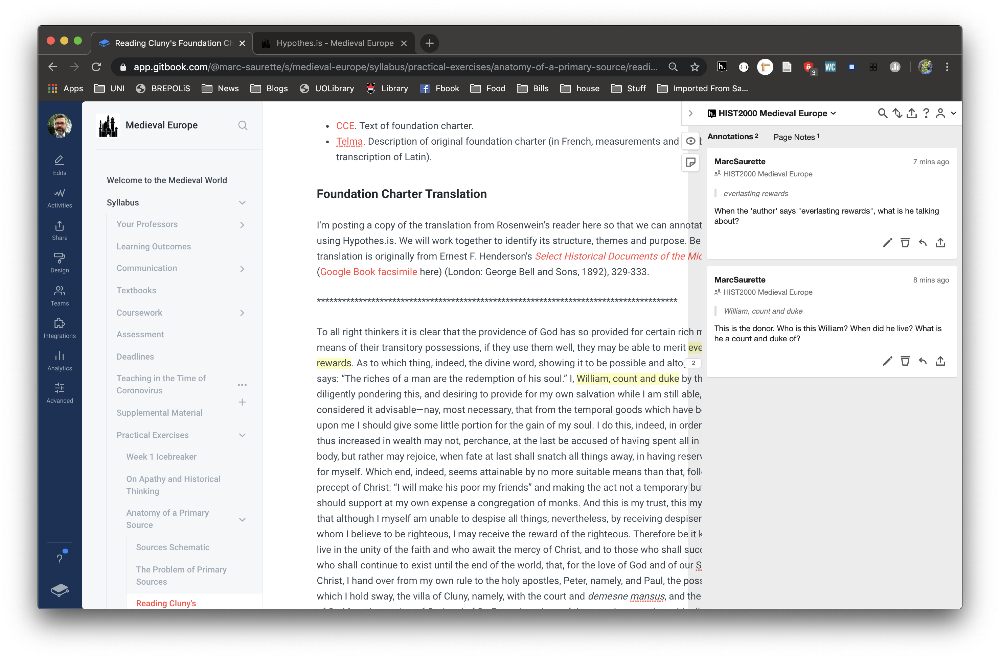

# Hypothes.is\*

​[Hypothes.is ](https://hypothes.is/)is a tool which allows you to annotate web content for your personal research use or, in our case, to allow us to collaborate as a group. It is, in essence, a digital version of you writing notes in the margins of a book/ photocopy. If you open a pdf in your browser, for example, you can annotate it and all your comments are saved in a central location.


The following are instructions for using hypothesis on a laptop/desktop.&#x20;

If you are using hypothes.is on a mobile device/ tablet, read their suggestions for best practices: [https://web.hypothes.is/help/how-to-use-hypothesis-on-mobile-devices/](https://web.hypothes.is/help/how-to-use-hypothesis-on-mobile-devices/)

It is also possible to use hypothes.is via Chrome to annotate pdfs on your local hard drive: [https://web.hypothes.is/help/annotating-locally-saved-pdfs/](https://web.hypothes.is/help/annotating-locally-saved-pdfs/)


### Quick start:

Click[ this link](https://hypothes.is/groups/LKiykDpj/mems3001-2023) to join the class hypothes.is group and register for an account.&#x20;

### Installing Hypothes.is

We will use hypothes.is _via_ a plug-in for Chrome or a Bookmarklet on other browsers.

1. If you don't already use Google Chrome, download a free copy [here](https://www.google.ca/chrome/) and install. The hypothes.is extension used to only works for Chrome, but now they give you other options. Chrome is still the most stable...

2\.  Navigate to the hypothes.is website ([https://web.hypothes.is](https://web.hypothes.is/)) and press the "Get Started" button in the top right corner.&#x20;

.png>)

3\. If you click on the "Get Started" button it will take you to page to sign up for an account and a link to download the Chrome extension.&#x20;

<figure><figcaption></figcaption></figure>

4\. First navigate to the account sign up. You can use any email and password. Just make sure to remember them both (even better, write them down somewhere safe). And then add your username to this [spreadsheet](https://docs.google.com/spreadsheets/d/13qCBEz-SuqnpS4KTj55guhPZ2Wr1dLi53RV-5BN87pA/edit?usp=sharing).&#x20;

5\. Go back to the previous page ([https://web.hypothes.is/start/](https://web.hypothes.is/start/)) and click to download the google chrome extension. Install it as your system requires.&#x20;

6\. If you need to reopen Chrome after installing the hypothes.is extensions, do so and navigate to any webpage. You should now find the hypothes.is icon on your browser. You can click on the icon to start it up hypothes.is.&#x20;

7\. It will open up a new sidebar. This is what mine looks like on a page I have already begun to annotate.&#x20;

8\. Hypothesis gives you three options to annotate. You can leave a comment on the page as a whole (by clicking on page icon, or clicking on the words "Page Notes".&#x20;

9\. If you click on the eyeball (?) icon or click on the word "Annotations" it will take you to annotations on specific text. To make an annotation simply select some text and either highlight it or choose to make an annotation. A text box will open in the sidebar.&#x20;

10\. After you have entered your text be sure to press the "Post to ..." button, which makes the text available for others to see. You can also add tags in case you want to keep track of certain kinds of information to be searchable later.&#x20;

11\. Before you annotate anything, however, you will need to sign into hypothes.is again using your username and password by clicking on the person icon in the top right corner.&#x20;

12\. Then click [this link ](https://hypothes.is/groups/LKiykDpj/mems3001-2023)to join the class annotation group. This is super important. We want you to post in a goup that we can find and that people don't see publicly (which is the default). The link will ask you to sign in again.&#x20;

13\. Then go back to the hypothes.is sidebar and on its top left corner you can select from "My Groups" i.e. where your annotations will appear. These are my choices - if you're using this for the first time your choices will be "Public" and "HIST2000 Medieval Europe". Select the second on the drop down menu. You'll notice that at the bottom of this drop down menu is the option to create a "New Private Group". If you want a group for annotations for doing research, you can create it and share it with others if you want.&#x20;

14\. Play around with Hypothes.is. The first step is to view this page with the plugin activated, and **see the final instruction I have posted there**. You might also want to make a separate private folder for comments you want to keep to yourself (or for each research project you are working on this year...).&#x20;

15\. For more of a sense of what hypothes.is can do, take a look at their [tutorials](https://web.hypothes.is/help-categories/tutorials/).

Join us here: [https://hypothes.is/groups/LKiykDpj/mems3001-2023](https://hypothes.is/groups/LKiykDpj/mems3001-2023).
