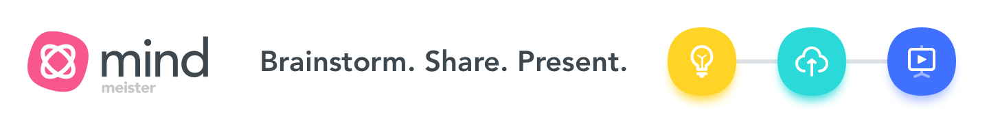

# Mindmeister\*

<figure><figcaption></figcaption></figure>

[Mindmeister](https://www.mindmeister.com/?r=976984) is a web-based interface to allow project planning or brainstorming to happen collaboratively. I feel like it might be a good place for us to share ideas or make mindmaps to keep us on track. It offers a good tool for visualizing ideas and knowledge, which some people (like myself) find very helpful.&#x20;

1. Please sign up for an account by clicking on this [link](https://www.mindmeister.com/?r=976984). It will take you to a sign up sheet like this:

<figure><figcaption>
Click on which ever works best for you. 
</figcaption></figure>

<figure><figcaption>
Click "Sign up" after you enter your details.
</figcaption></figure>

2\. Click on "Sign Up" after you enter your information. You can use any email – just keep track of your username. [Add you name to this spreadsheet.](https://docs.google.com/spreadsheets/d/13qCBEz-SuqnpS4KTj55guhPZ2Wr1dLi53RV-5BN87pA/edit?usp=sharing)

<figure><figcaption>
Check your email and click on the link that they provide. 
</figcaption></figure>

Mindmeister gives you different options for plotting your information. You can play around with options when you get logged in, from a screen that will look something like this:&#x20;

<figure><figcaption></figcaption></figure>


Mindmeister allows you three (3) free maps in its basic (free) service. If you sign up for an account via this [link](https://www.mindmeister.com/?r=976984) it gives me an additional map I can see (which is important if you want me to see a map you create).&#x20;


I've started a planning map that students can contribute to once you're signed up. You can request to edit or I'll give you edit privileges, when you've given me your name [in this spreadsheet](https://docs.google.com/spreadsheets/d/13qCBEz-SuqnpS4KTj55guhPZ2Wr1dLi53RV-5BN87pA/edit?usp=sharing). Consider the outline very much _in progress_.&#x20;

You can see it via the links below:

* [https://mm.tt/map/2466082883?t=TghzY51msI](https://mm.tt/map/2466082883?t=TghzY51msI)

<figure><figcaption></figcaption></figure>
