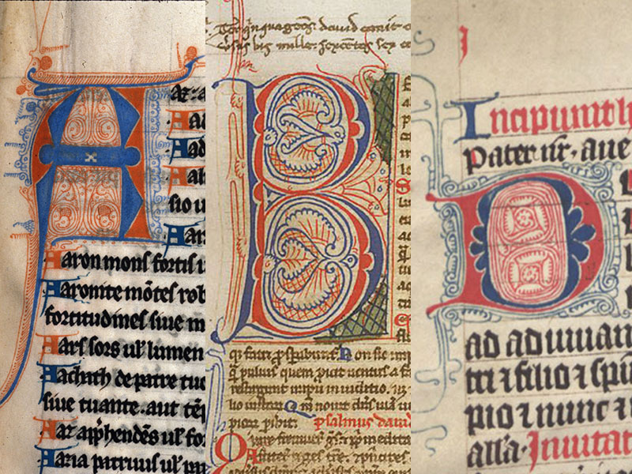

# 6. Decoration\*

## Overview

Often students will choose a manuscript folio to work on based on its visual appeal - size, decoration, borders all make a folio immediately interesting even before the content is understood. For a medieval audience, its decorative program was intended partly to awe (which still can work on us!), but also to serve a practical purpose - to designate units of meaning (usually rubrication and use of capitals) and to illustrate the text (to make it noteworthy or to add further means to reflect on the content).&#x20;

Most manuscripts either show simple decorative schemes or are plain and unadorned. But, these kinds of manuscripts are less likely to be dismembered and sold as single folios (by which our library acquires them). And our folios have been acquired both as part of a research collection for the library (e.g. history of the book) but many of them are come from the collection of the Carleton University Art Gallery and were selected particularly for their visual appeal. So, our manuscripts are perhaps not representative of medieval manuscripts as a whole (but they are representative of what North American libraries usually contain).&#x20;

When manuscripts were decorated to any degree the process and scheme of this decoration was usually planned before the text was copied. The process usually followed a typical order 1) writing the main text, 2) rubrication 3) decoration 4) illustration, in which blank spaces were left blank to be filled in later. Perhaps your text offers evidence of this process - a guide letter for a capital left in the margin or a blank space where a capital should be inserted, but never was?

Medieval manuscript decoration: &#x20;

* could enhance the appearance of the book, and its value (both in the past and today),&#x20;
* could  function as a statement of the importance of the person or institution that had commissioned or owned the book.&#x20;
* was intended to aid the reader by offering visual as well as textual contents, to help the reader find his or her way around the book, or to aid the interpretation of a text. The use of initials, illustrations and borders could announce text divisions, or indicate important sections of a work, or could be designed to help the reader engage with the contents of text.

It is the goal of this exercise to be able to describe and the reproduce the decorative program of your folio, in part so that you can understand how the book functions to convey meaning, both as a text and as a material object.&#x20;

## Part I. Describing rubrication and decorations


This must be completed before class.&#x20;


Your goal in describing the decorative program is to account for all the visual elements of the page (other than the main text). You will likely need to find further terminology for understanding and describing the visual components of your folio – I recommend starting with Michelle Brown's _Understanding Illuminated Manuscripts. A guide to terminology_ (posted on Perusall).&#x20;


While difficult when working with digital surrogates of your folios, try to distinguish between painted decoration/ initials and ink decoration/initials.&#x20;


For our purposes, we wish to think about rubrication, decoration and illustration:

* What is rubricated? Is there a system/ hierarchy of rubrication? Are something things written in red while others are highlighted in red?&#x20;
  * Identify all text which is rubricated in your transcription.&#x20;
* Decoration can include many elements: borders, line fillers, fretwork, heraldic devices, and capitals (aka initials). You should ask:
  * are there [borders](https://www.bl.uk/catalogues/illuminatedmanuscripts/GlossB.asp#BORDER)? Are they simple ink lines or ornated foliated borders? Describe colour, patterns, distinctive elements (acanthus leaves, carnations, animals, coats of arms?).
  * how are capitals/initials presented: identify their colour, their nature, their size (usually understood as number of written lines). Distinguish between simple [initials](https://www.bl.uk/catalogues/illuminatedmanuscripts/GlossI.asp#INITIAL) (such as, _littera notabilior_ which denote the beginning of a new sentence/ sense unit), initials with some decoration, [pen flourished](https://www.bl.uk/catalogues/illuminatedmanuscripts/GlossP.asp#PEN-FLOURISHEDINITIAL) filigree initials (usually alternation, red and blue) and miniatures/ historiated initials. Note their position: are they contained within the textual columns or do they extend outside? Can you see evidence of guide letters?
    * identify all letters in your transcription which are initials. Establish a legend for distinguishing between types of initials (using font size, colour, etc.)
    * For a basic introduction to  types of initials, [see this guide](https://www.europeana.eu/en/blog/lighting-the-way-how-illuminated-initials-guided-medieval-readers-through-books) on Europeana.eu (an EU-supported portal for European national library digitizations).
  * &#x20;Is there a pattern/system you can discern to capitals and rubrication (usually only with longer manuscripts can this be understood, but take a stab at describing the system)?&#x20;
  * what other decorative elements are there: line fillers, fretwork? If you see other decorative elements, try to describe how they look, how many of them are there.&#x20;
  * If there is illumination, does it rise off the page (i.e. can you see a gesso underlayment which gives dimensionality to the gold leaf? Or does it look more like gold paint?
* Illustrations can take many forms: author portraits at the beginning of a manuscript, column pictures, grisaille, inhabited or historiated borders, rectangular miniatures (framed or unframed), marginalia or historiated initials, anthropomorphized letters, are there charts or diagrams? Is there a cycle of painting (usually also only discenible in works longer than we have access to...)?
* Compare the inks on your folio with those described on the _Teaching Manuscripts_ website ([https://www.teachingmanuscripts.com/colours](https://www.teachingmanuscripts.com/colours)) which offers a description of how different inks were made in the Middle Ages and provides some images (to get a sense of their colours/tones). List all the colours/inks you are able to see. In preparation for your continued work on your facsimile folio, make a list of&#x20;

## Part II. Decoration and Rubrication Exercise:

For today's exercise, we will focus on reproducing initials.&#x20;

In medieval book production, decoration and rubrication would take place in stages. In a simple manuscript, the body text (in black) would be completed first, and the rubrication and decoration completed afterwards. Evidence for this process is sometimes contained in the manuscript - [guide letters](https://www.bl.uk/catalogues/illuminatedmanuscripts/GlossG.asp), for example, will be written by the initial scribe in the outer margin or gutter in order to let the decorator know what letter needs to be added later.&#x20;

For a basic introduction to  types of initials, [see this guide](https://www.europeana.eu/en/blog/lighting-the-way-how-illuminated-initials-guided-medieval-readers-through-books) on Europeana.eu (an EU-supported portal for European national library digitizations).

In the decorative stages, the _limner_ typically began by working in lead plummet (precursor to graphite pencils), crayon or ink, sketching in the overall design and layout for the decoration or illustration and drawing any framing devices. If the preliminary sketching was in plummet or crayon, the illuminator might also sharpen up the design in pen and ink. Areas to be gilded would receive a layer of size (a glutinous wash) or gesso (gypsum) in preparation for the application of the gold leaf. Following the application and burnishing of the gold leaf, the limner began to apply pigments to the rest of the decoration or illustration.&#x20;

While we likely won't be working with gesso/gold leaf due to time constraints, our goal is to try to reproduce aspects of your folio's decorative program, through a simplified series of efforts. You can work at the same scale as your folio or increase the size in your work if that helps you visualize the process better.&#x20;

1. Your goal is to begin with the simplest capitals your text presents and then progress afterwards to the more complex ones. _Littera notabilior_ (i.e. the capital letter at the beginning of sentence) are usually in red/blue, or a capital letter in brown/black ink highlighted in red. Try to discern how the letter can be broken down into a series of strokes and if multiple inks are used, which are used first.&#x20;
   1. with a pencil (and then outlined in pen) on some scrap paper, trace out the strokes for the letter you want to practice. Number each stroke and, with arrows, show which way the pen seems to be moving. Does the letter require an outline (which is then filled in with more ink or embellished with further strokes)?
   2. Try reproducing the initial in ink(s) to see how using a quill changes the process of initial making.
2.  After you have attempted to reproduce the simplest initials (or just one of them), move to the most complex versions.&#x20;

    1. Using a pencil (later outlined in ink) trace out the components of your initial.&#x20;
    2. Does your initial have a border, for example? Is it a box (single lined or more?), is the box added before or after the letter (does it hug the letter or is it standardized, is a good way to make this assessment).&#x20;
    3. How is the initial layered? Distinguish which parts come first, which are added afterwards. This will give you a system for designing an initial (part 3, below).&#x20;
    4. Some folios might have simple decorative programs. Charter no. 1, for example, only has capitals (in a chancery form) on the top line and _litterae notabiliores_ in the body. You can work with what you have or look to another example if you wish.&#x20;

## Optional Exercise: Illumination

Students might wish to complete an additional exercise involving gilded illumination. Details to follow but likely the exercise will be completed outside class time.&#x20;

For an idea of how medieval scribes would apply illumination to their folios, see the following tutorial by Sara Charles:


Another cat filled tutorial about medieval illumination

