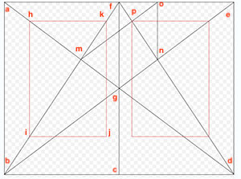

# Folio Measurements

Medieval manuscript layout followed a regular format, based on an ideal of proportion.&#x20;


_**Bifolium**_\
\- a _sheet_ folded in the middle so as to form two leaves (_folia_); each leaf has two sides.

The two leaves are _conjoint_ or _conjugate_ leaves (each being the conjoint or conjugate leaf of the other); they are respectively the anterior and the posterior leaf.\
A convenient way of mentioning e.g. ‘ff. 26 and 29, that are conjoint’ is to print ‘ff. 26^29’.


Your goal to prepare for your reconstruction of a folio facsimile is by taking measurements of the writing space, compared to the size of the folio, and all the lines within and without, according to the following templates:

You should try to record, in millimetres, measurements of all of the following (in reference to the above diagrams):

* writing frame (STUV)
* frame lines (ST, UV, SU, TV)
* top line (ST)
* bottom line (UV)
* bounding lines (SU, TV)
* intercolumnar lines (C, D, E)
* occasional intercolumnar (P, Q)
* marginal lines (KL + H + MN)
* pricking (x, y)

Not pictured but necessary to measure (if relevant)

* space allotted for initials, decorative space,&#x20;
* musical lines (length, number, interlinear spacing, distance from text

<figure><figcaption>
From <a href="http://www.cei.lmu.de/extern/VocCod/WOR10-3.pdf">http://www.cei.lmu.de/extern/VocCod/WOR10-3.pdf</a>
</figcaption></figure>
