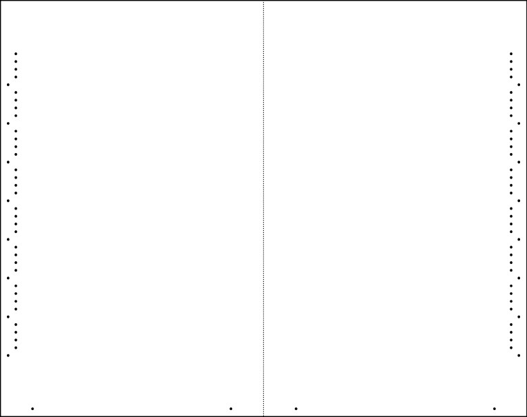
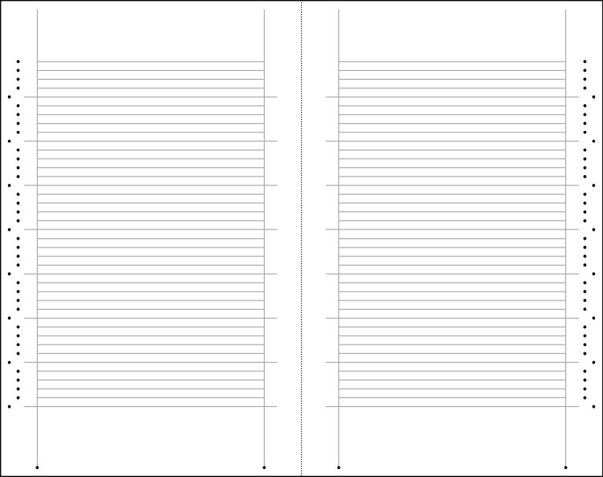
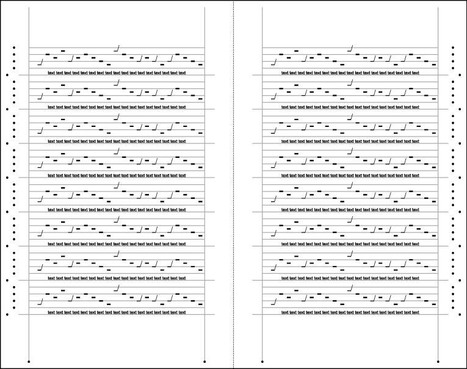
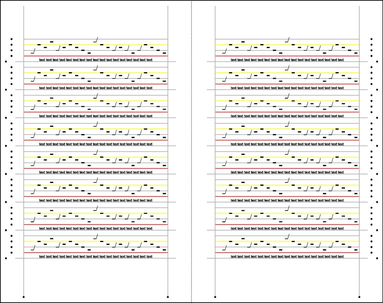
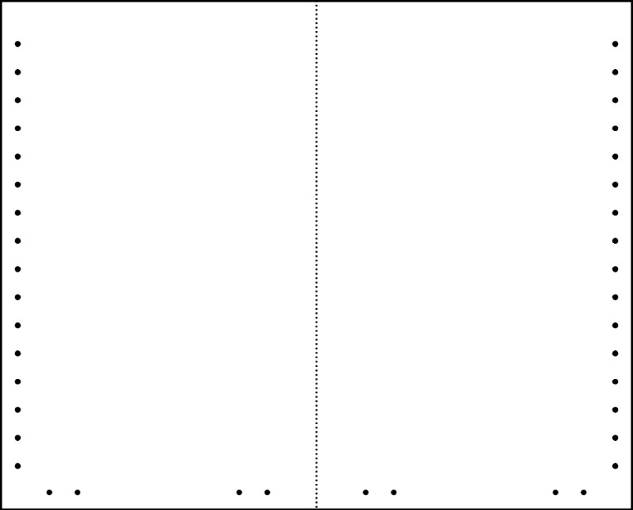
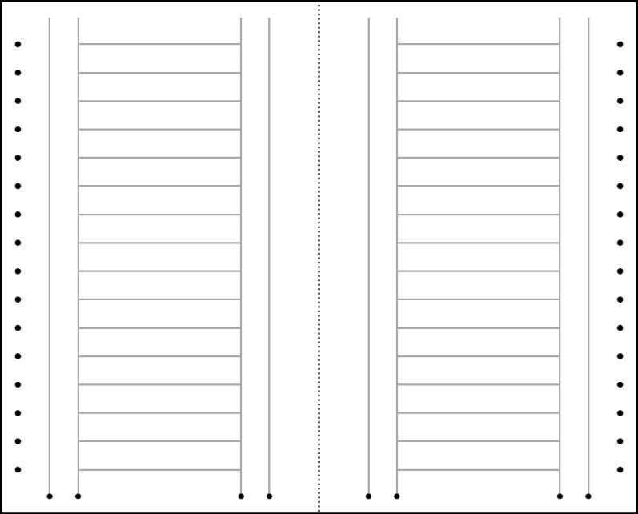
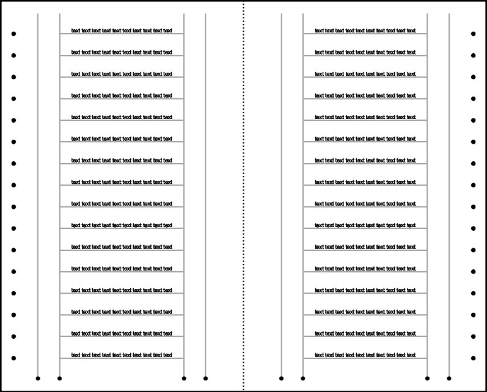
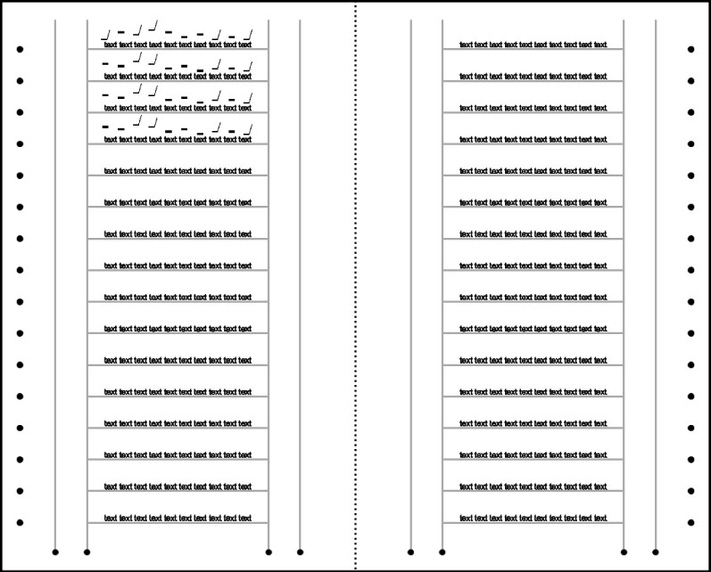

# 3. Reproducing the Ruling

This exercise involves cutting pages to the size of your parchment/folio. We will then then beginning turn it into a usable form, by  delineating text blocks and lines (etc) to be filled with content in the future.

<figure><figcaption>
Most of our examples are "loose leaves" but we want a double-leaf (aka <em>bifolium</em>) for binding.
</figcaption></figure>

### Goals

* use measurements from the [previous exercise](folio-measurements.md) to recreate the size and layout of your selected folio
* reflect on the practical reasons why medieval scribes divided up the page as they did
* learn terminology for describing the mise-en-page of medieval folios&#x20;

### Requirements

* parchment/ paper (you cut to proper size)
* straightedge and ruler/measuring tape
* pencil/graphite/lead point/ink (depending on your exemplar)

### Preparatory Reading

* Marie-Hélène Tesnière, "The _Mise-en-page_ in Western Manuscripts." In _The Oxford Handbook of Latin Palaeography_. Frank Coulson and Robert Babcock, eds.New York: Oxford University Press, 2020: 619-638.&#x20;
* Stephen Partridge, "Designing the Page," in _The Production of Books in England 1350-1500_. Daniel Wakelin and Alexandra Gillespie, eds. Cambridge: Cambridge University Press, 2011: 79-103.

_Optional_:&#x20;



### Stages

1. Produce 4 sheets reproducing a _bifolium_ from the manuscript of your example

<figure><figcaption></figcaption></figure>

 

<figure><figcaption></figcaption></figure>

* As you  have read about this week, medieval manuscripts organized their information along typical patterns, as shown in the diagrams (taken from the _Oxford Handbook of Latin Palaeography_). Folios show the "rulings" (i.e. lines demarcating text spaces) made in drypoint, graphite, or ink (black or red). Your goal in this exercise is to observe and record, and then reproduce the ruling pattern for the manuscript folio you are studying. If studying a bifolium, try to see how the ruling works across a single side (i.e two pages).
* For examples and explanations of the terminology around ruling, consider the page on [fundamentals of page layout](https://www.khanacademy.org/humanities/medieval-world/medieval-book/making-medieval-book/a/the-work-of-the-scribe) prepared by Erik Kwakkell (palaeographer extrodinaire at UBC):

Every folio in our collection has a different ruling pattern, so the schematic above will not account for every example – especially those containing music. You are expected to measure as many as possible of the rulings identified in the figures above, such as the:

* intercolumnar lines (if your folio has two or more columns)

You will also need to observe and measure space used for:

* initials (usually extending slightly into the margin outside the writing frame)

Also record whether lines are ruled in lead/graphite, ink or blind ruled (i.e. a hardpoint leaving an impression).

Often folios will be trimmed or resized after being bound/rebound. Prickings will regularly be cut off at the outer margin of folios (top, bottom and outer) for aesthetic reasons. There may be pricking that survives in the inner margin if each folio (as opposed to a bifolium) is ruled individually. Usually however (as the two examples below indicate) a single side of a bifolium (i.e. two pages) is ruled at once.


A typical medieval gathering of pages would be 8 folios (so 4 sheets). Your goal will be to cut at least 3 sheets to size.&#x20;


1. Using the measurements of the folio you are studying, cut the paper provided into a suitable size for a _bifolium of your manuscript_. Most of the examples in our collection are orphan folios (i.e. only 1/2 a bifolium needed for binding; aka _looseleaf_). If you have a single folio (i.e. two page sides), double the width of your page (plus maybe a bit more if you want to remove the prickings after ruling). If you have a bifolium (i.e. four pages) use your original measurements.

2\. Attach your paper to a work surface with removable tape so as to not damage the surface.

3\. With an awl and ruler, make a series of holes corresponding to the pricking pattern on your folio or which can be reconstructed from the ruling you can observe/ have measured. Since we're using paper, the prickings might be less obvious than you might see in parchment (and than you might want). If you prefer to use pencil, that is fine (but using an awl allows you to do the measurements for all your sheets at the same time).&#x20;

4\. Using a straightedge, rule one side (i.e. two facing pages) of your sample bifolium using a drypoint, pencil or ink. Start with vertical lines to delineate columns, the upper and bottom line of the writing frame, space for initials/decoration, and then the horizontal line rulings.

&#x20;                                                                ⁂

The two following series of images show the progressive stages of manuscript production of _liturgical_ manuscripts and can be a model for how to progress with your work.

#### Example 1. Bibliothèque nationale de France, fonds latin MS 778. _Narbonne Troper_ (twelfth century CE)

In the pricking pattern below, every fifth prick sits to the side, indicating to the text scribe that it was the text line (step 1). The folios were ruled in dry point (step 2), then came text and notes in ink (step 3), and finally the dry lines were coloured red and yellow (step 4). The result of this increased space for music was a larger note; the size of text and music was now roughly the same.

<figure><figcaption>
Stage 1 - Pricking a bifolium.
</figcaption></figure>

 

<figure><figcaption>
Stage 2. Ruling the writing frame
</figcaption></figure>

 

<figure><figcaption>
Stage 3. Adding Text, then adding notes in black ink
</figcaption></figure>

 

<figure><figcaption>
Stage 4. Rule the musical staff in red/yellow over drypoint lines
</figcaption></figure>

#### Example 2. Corpus Christi College, MS 473. Winchester Troper (ca. 1000 CE)

In this earlier example, sixteen holes, roughly 7-8 mm apart in height were pricked in the margin (step 1) and the lines ruled (step 2). Text was written on each one (step 3), and then music fit above each line of text (step 4). In other words, no ruling line was skipped for music. Notes tended to be smaller than the text letters.Stage 4. Fitting notes above text lines.

<figure><figcaption>
Pricking top and bottom
</figcaption></figure>

 

<figure><figcaption>
Text blocks delineated in lead point
</figcaption></figure>

 

<figure><figcaption>
3. Text added
</figcaption></figure>

 

<figure><figcaption>
4. Notes added (note the lack of staff!)
</figcaption></figure>


When you have completed ruling all portions of your folio you are done!

